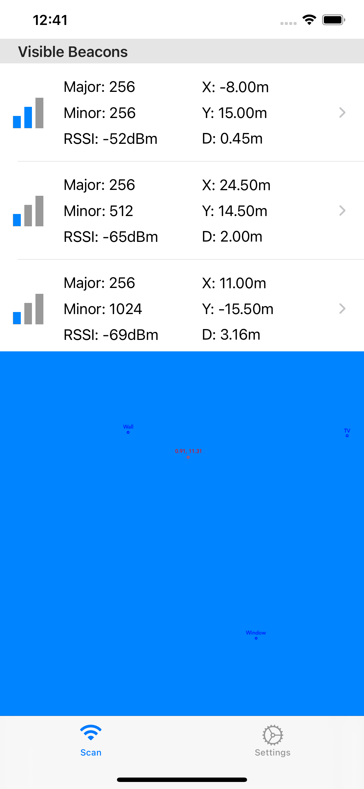
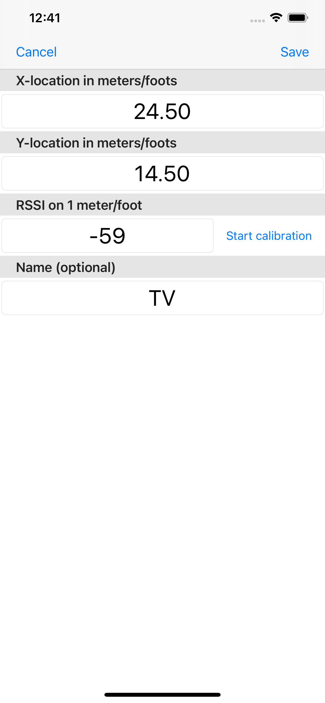
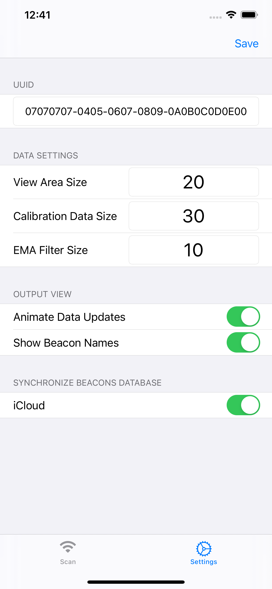

# BeaconIL


**BeaconIL** (Beacon Indoor Localization) is an iOS app for indoor positioning based on **iBeacon** BLE beacons. It scans nearby beacons, estimates the distance to each one from signal strength (RSSI), computes the device's position via trilateration, and renders it in real time on a floor plan.

> The math core — trilateration via the Levenberg–Marquardt algorithm — is implemented in the `LMAMath` class and matches the standalone Go library [lmamath](https://github.com/Vitaliy69/lmamath). The two ports were cross-validated on shared test vectors: identical results to twelve decimal places on exact inputs, sub-micrometer agreement on noisy ones.

**Measured result:** in a 4 × 6 meter room with three calibrated beacons, the position estimate stays within ~0.5 m of the true location.

## Features

- **iBeacon detection** by a configurable UUID via CoreLocation (ranging + monitoring).
- **RSSI-to-distance conversion** based on the calibrated power at 1 meter (`txCalibratedPower`).
- **RSSI smoothing** with an Exponential Moving Average (EMA) filter and a configurable window size for stable readings.
- **Beacon calibration** — averaging a configurable number of measurements to determine the 1-meter RSSI.
- **Trilateration** (Levenberg–Marquardt, non-linear least squares) — computes the device position from distances to at least 3 beacons.
- **SpriteKit visualization** — beacons and the estimated position are drawn on a scene; a floor-plan background image can be loaded from the photo library.
- **Beacon configuration persistence** in Core Data.
- **iCloud synchronization** (`NSPersistentCloudKitContainer`) — optional, across the user's devices.
- **Live list of visible beacons** with RSSI, distance and a proximity indicator (immediate / near / far).

## Screenshots

| Main screen: live beacon list + floor-plan visualization | Per-beacon calibration | Global settings |
|:---:|:---:|:---:|
|  |  |  |

## Architecture

| Component | Responsibility |
|---|---|
| `ScanController` | Main screen: beacon list (`UITableViewDiffableDataSource`) and SpriteKit visualization. Manages dispatch thread isolation between background BLE ranging events and main-thread UI/render topology updates. |
| `BeaconScan` | Wrapper around `CLLocationManager`: iBeacon ranging via `CLBeaconIdentityConstraint`, building the snapshot of visible beacons, calibration mode. |
| `BeaconKnown` | CRUD for stored beacons (coordinates, 1-meter RSSI, name) on top of Core Data. |
| `IndoorMath` | Per-beacon RSSI storage, EMA smoothing, RSSI-to-distance conversion and trilateration call (`getLocation()`). |
| `LMAMath` | Trilateration via the Levenberg–Marquardt algorithm (`solve(positions:distances:)`). |
| `BeaconData` / `RssiStorage` | Data models for a visible beacon and its RSSI history. |
| `Beacons` (+ `BeaconCoordinates`) | Core Data entity; beacon coordinates are serialized to JSON via `Codable`. |
| `VisualizationScene` / `VisualizationObject` | Rendering of beacons, position and the floor-plan background on an `SKScene`. |
| `ApplicationSettings` | App settings in `UserDefaults` plus the background image. |
| `SettingsViewController` / `BeaconSettingsController` | Global settings screen and per-beacon settings/calibration screen. |

## How it works

1. An iBeacon region UUID is configured (default `07070707-0405-0607-0809-0A0B0C0D0E00`). For each beacon its coordinates `(x, y)`, 1-meter RSSI and name are stored (Core Data, JSON serialization).
2. `BeaconScan` receives the list of visible beacons from CoreLocation; for each known beacon its coordinates and parameters are looked up.
3. `IndoorMath` accumulates RSSI values and smooths them with EMA:

   `ema = (rssi_new − rssi_old) · 2/(N+1) + rssi_old`, where `N` is the EMA window size.
4. The smoothed RSSI is converted to distance:

   `distance = 10 ^ ((txCalibratedPower − rssi) / 20)`.
5. With ≥ 3 beacons, `LMAMath.solve(positions:distances:)` minimizes the sum of squared residuals

   `f(x) = Σ ( ‖x − pᵢ‖² − dᵢ² )²`

   using the Levenberg–Marquardt algorithm and returns the device coordinates.
6. `VisualizationScene` draws the beacons and the estimated position on top of the floor plan.

## Settings

Global (Settings screen):

| Setting | Range | Default | Purpose |
|---|---|---|---|
| UUID | format `12345678-1234-1234-1234-1234567890AB` | `0707…0E00` | iBeacon region UUID |
| View Area Size | 10…200 | 50 | Working area size / scene scale |
| Calibration Data Size | 10…150 | 30 | Number of measurements per calibration |
| EMA Filter Size | 5…100 | 10 | RSSI smoothing window size |
| Animate updates | — | On | Animate position updates |
| Show names | — | On | Show beacon names |
| iCloud sync | — | On | CloudKit synchronization (requires restart) |

Per beacon (Beacon Settings screen): `X`/`Y` coordinates (within `-areaSize…areaSize`), 1-meter RSSI (`-110…-40`), name (up to 12 characters) and **calibration**.

### Calibration

Place the iPhone/iPad 1 meter away from the beacon at the same height and start calibration. The app averages `Calibration Data Size` RSSI measurements and stores the result as the "1-meter RSSI". Do not background the app during calibration.

## Requirements

- iOS 13.0+
- Xcode 12+ / Swift 5
- A **real device** — iBeacon detection is not available in the simulator
- For iCloud sync: the **iCloud → CloudKit** capability and an active iCloud account

## Build & Run

1. Clone the repository:

   ```
   git clone https://github.com/Vitaliy69/BeaconIL.git
   ```

2. Open `BeaconIL.xcodeproj` in Xcode.
3. In **Signing & Capabilities** select your development team; if you use synchronization, configure **iCloud (CloudKit)**.
4. Make sure the location usage key is set in `Info.plist`:
   - `NSLocationWhenInUseUsageDescription`
5. Run on a real device, then add beacons: tap a beacon row in the list, set its coordinates and calibrate it.

## Tests

The math core (`LMAMath.swift`) is also compiled as a standalone Swift package target, so the solver can be tested without opening the Xcode project or a device:

```bash
swift run beaconil-tests
```

The suite runs 11 checks: exact and noisy solutions, higher-dimensional anchors, cross-validation against the Go port ([lmamath](https://github.com/Vitaliy69/lmamath)), and rejection of malformed inputs (zero/negative/NaN distances, non-finite coordinates, inconsistent dimensionality).

## License

Released under the MIT License. See the [LICENSE](LICENSE) file.
